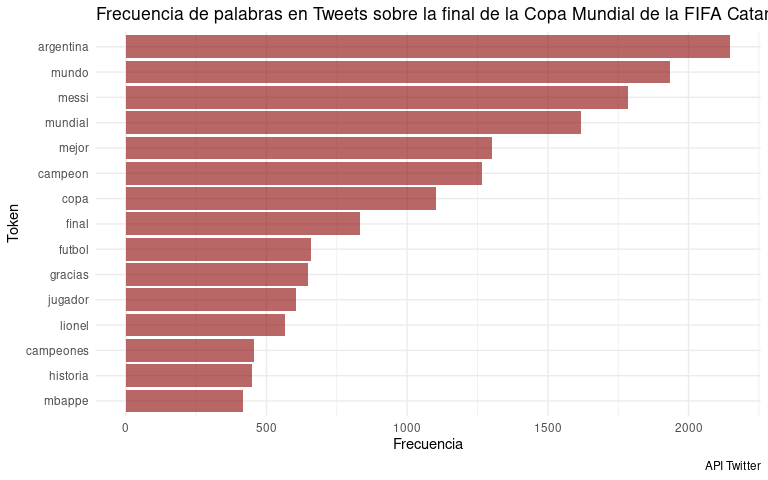
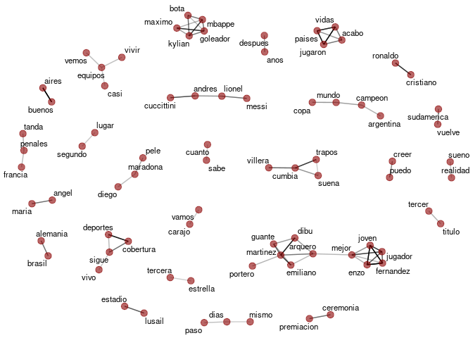
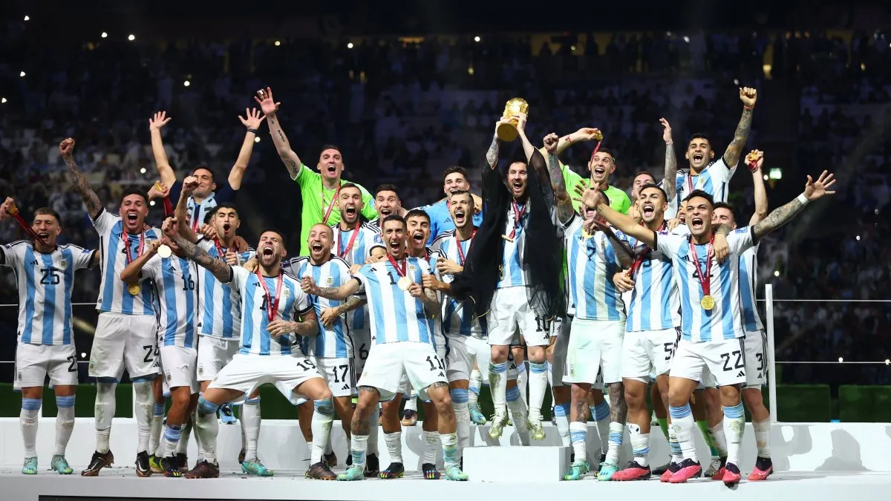

Variables Textuales: Tweets sobre la final de la Copa Mundial de la
FIFA - Catar 2022
================
Maribel Fraire
2023-01-21

-   [Índice](#índice)
-   [Introducción](#introducción)
-   [Seleccón](#seleccón)
-   [Limpieza](#limpieza)
-   [Exploración de los datos](#exploración-de-los-datos)
    -   [Frecuencias y nubes de
        palabras](#frecuencias-y-nubes-de-palabras)
    -   [Co-Ocurrencia y asociación de
        palabras](#co-ocurrencia-y-asociación-de-palabras)

## Índice

1.  Introducción
2.  Selección
3.  Limpieza
4.  Exploración
5.  Comunicación

# Introducción

Cada vez son más las personas que utilizan redes sociales para comunicar
sus sentimientos, experiencias, opiniones e interactuar con otros
usuarios. En febrero de 2021, el número de usuarios activos mensuales de
Twitter en Argentina superó los 5,4 millones.

La información allí alojada representa un insumo importante para
estudiar “Qué es lo que está pasando” en nuestra sociedad. Si bien su
alcance es limitado dado que comprende a la población usuaria de la
aplicación. Los datos proporcionados permiten un acercamiento al clima
de época, los vocablos presentes, la simbología utilizada, los
sentimientos o expresiones de valor manifestadas en sus posteos, las
figuras públicas más mencionadas, las preferencias y temas de interés de
un sector social en un contexto determinado.

El triunfo de la selección argentina en la Copa Mundial de la FIFA Catar
2022 sentó un hito en la historia deportiva y cultural de nuestro país.
Conocer cómo se vivió un evento de esta magnitud es una de las
motivaciones presentes en este trabajo.

En el presente estudio se analizan las expresiones de los usuarios de
Twitter en el marco de la final de la Copa Mundial de la FIFA Catar 2022
a través de los datos proporcionados por la API de Twitter.

En primer lugar se describe el proceso de selección del set de datos,
luego se reflejan las tareas de limpieza de las variables textuales,
posteriormente se realiza una exploración de los resultados obtenidos,
lo cuales son visualizados a través una Shini APP.

# Seleccón

Los datos utilizados se descargaron desde la API de Twitter mediante el
paquete de R rtweet. La información provista por esta aplicación abarca
retweets, favoritos, texto de la publicación, idioma, fecha, entre
otras. En el marco de esta presentación, se puso el foco en la variable
Texto y se consideraron los posteos realizados desde el 18 al 24 de
diciembre de 2022 en idioma español, con el hashtag \#Qatar2022, sin
incluir retweets. Se revisaron mails con etiqueta de “posiblemente
sensibles” y fueron conservados dado que no se observó lenguaje
ofensivo. Esta categorización se suele aplicar a tweets que contienen
enlaces.

``` r
library(pacman)
p_load(rtweet, tidyverse, ggplot2, tm, textclean, tidytext, widyr, stopwords, 
       rtweet, ggwordcloud, igraph, ggraph, stringr,textclean, wesanderson,
       igraph, ggraph)
```

``` r
#Run date: 12-26-2022
qatar <- search_tweets("#Qatar2022", n = 10000, include_rts = FALSE, lang = "es")
save(qatar, file = "qatar2.26-12-22.RData")
```

``` r
load("qatar2.26-12-22.RData")

#Variable selection
mundial <- qatar %>% select(created_at, id_str, 
                             full_text,display_text_range, source, 
                             retweet_count, favorited, favorite_count,
                             retweeted, possibly_sensitive,
                             lang, text)

#Convert tibble to data frame
mundial <- as.data.frame(mundial)
```

``` r
#Review data
#Possibly sensitive tweets
knitr::kable(mundial %>% filter(possibly_sensitive == TRUE) %>% select(text) %>% head())
```

| text                                                                                                                                                                                                                                                                                                       |
|:-----------------------------------------------------------------------------------------------------------------------------------------------------------------------------------------------------------------------------------------------------------------------------------------------------------|
| \#FUROR A poco de comenzada la preventa online, los fanáticos arrasaron con el modelo que se estrenó tras ganar el Mundial Qatar 2022. Los detalles, en la nota \#ARG \#LaScaloneta \#Camiseta \#Qatar2022                                                                                                 |
| <https://t.co/s9GAULANgZ>                                                                                                                                                                                                                                                                                  |
| 🗣️ \| El delantero de Suiza, \#BreelEmbolo, quien llamara la atención durante el Mundial de \#Qatar2022 al convertirse en el primer futbolista en hacerle un gol al país en el que nació (Camerún), protagonizó en Nochebuena un choque multimillonario en las calles de Mónaco. <https://t.co/sy9PDBQKhy> |
| Buenos Aires 1910 \#FIFAWorldCup \#Argentina \#Qatar2022 \#Congratulations <https://t.co/5fGYqAT1lc>                                                                                                                                                                                                       |
| Después de tanto tiempo la espera acabó Leoooooo…. Eres Grande diste lo mejor de ti en este mundial… Mil felicidades y que sigan los éxitos 🎉🎉                                                                                                                                                           |

Te Amo Hasta Siempre 🏆🥇🇦🇷🤍💙

\#ArgentinaCampeon 🏆🎉 \#Qatar2022 <https://t.co/Srl53OTDFU> \| \|Se lo
merece , se lo merece LIONEL MESSI , el mejor jugador de la historia
🔥💜 WE’RE THE DREAMERS 💜

\#Qatar2022 \#Messi𓃵 \#FIFAWorldCup \#Dreamers <https://t.co/UA7CUjdOLp>
\| \|si trajo la copa 💙🤍💙💙🤍 \#Qatar2022 \#WorldCupFinal
<https://t.co/eQEH7Ug84K> \|

# Limpieza

Para la etapa de depuración de los datos textuales se utilizaron las
funciones de los paquetes stringr, textclean, stopwords, tm las cuales
permiten: buscar y reemplazar, pasar a minúsculas, eliminar caracteres,
stopwords, espacios, enlaces o código html.

``` r
mundial$clean <- mundial %>% pull(text) %>% 
  str_to_lower() %>%   # Change all to lowercase
  replace_non_ascii() %>%   # Replace Common Non-ASCII Characters
  str_replace_all("\n", " ") %>% 
  replace_url() %>% #Remove url
  replace_html() %>% 
  replace_hash() %>% #Remove Twitter style hash tags (e.g., #rstats)
  replace_tag() %>%  #Remove Twitter style handle tag (e.g., @trinker)
  replace_word_elongation() %>% #Shorten expressions
  str_replace_all("[^[:alpha:]]", replacement = " ") %>% 
  removeWords(c(stopwords("es"), "copyright", "registered trademark", "mu")) %>% 
  str_squish() #removes whitespace at the start and end, and replaces all internal whitespace with a single space
```

# Exploración de los datos

## Frecuencias y nubes de palabras

Para esta etapa se estudia la frecuencia de las palabras en los posteos.
Para ello se contabiliza cuántas veces aparece cada token\* y se
representan visualmente en una nube de palabras presentada mediante la
Shini APP [Link de acceso a la Nube de
palabras](https://69qhf4-maribel-fraire.shinyapps.io/shini_qatar/). De
esta manera se pueden apreciar los vocablos más utilizados en el marco
de los festejos de la copa del mundo.

Para contabilizar las palabras se realizó una tokenización, mediante la
función *unnest_tokens()* la cuál separa cada documento en tokens,
ubicando un token por fila. Luego con la función count() se agrupa cada
token y se contabiliza su frecuencia.

(\*) Se considera token a cada palabra presente en el posteo y documento
al tuit en su conjunto.

``` r
df_frecuency <- 
  mundial %>% 
  mutate(id = row_number()) %>%   #columna con el index 
  unnest_tokens(words, clean) %>%   #split a column into tokens, one-token-per-row
  count(words, sort = TRUE, name = "frec")  %>% 
  filter(nchar(words) > 3) 

df_frecuency[1:10,]
```

    ##        words frec
    ## 1  argentina 2149
    ## 2      mundo 1933
    ## 3      messi 1784
    ## 4    mundial 1617
    ## 5      mejor 1301
    ## 6    campeon 1267
    ## 7       copa 1102
    ## 8      final  832
    ## 9     futbol  657
    ## 10   gracias  648

``` r
df_frecuency %>% 
  slice_max(frec, n = 15) %>% 
  ggplot() +
  aes(x = reorder(words, frec), y= frec) +
  geom_bar(stat = "identity", fill = "darkred", alpha = 0.6) +
  coord_flip() +
  labs(title = "Frecuencia de palabras en Tweets sobre la final de la Copa Mundial de la FIFA Catar 2022", 
       x = "Token", y ="Frecuencia", caption = "API Twitter")  +
  theme_minimal()
```

<!-- -->

## Co-Ocurrencia y asociación de palabras

Este análisis permite identificar apariciones conjuntas, de dos términos
en un documento. Para su visualización se utiliza un grafo, cuyos puntos
son los token y el grosor y la longitud de las aristas representa el
grado de la asociación.

Para ello se tokenizan los documentos asignando un id para mantener
referencia al documento.

Luego con la función *pairwise_count()* se cuentan los pares de ítems
dentro de un grupo definido por una característica, en este caso el id.
Se obtiene un data set con tres columnas Item1, Item2 y n que refleja la
cantidad de veces que ambos ítems o token aparecen juntos.

Para medir la asociación entre variables binarias, se utiliza el
coeficiente ϕ, que compara la presencia de un par de palabras en un
documento o la ausencia de ambas frente a la probabilidad de que una
palabra aparezca sin la otra. Va de -1 a 1. Se utiliza mediante la
función *pairwise_cor()*, la cualque encuentra correlaciones entre pares
de elementos (palabras) de una columna vinculados con una característica
en común (ID).

``` r
df_associate <-
  mundial %>% 
  mutate(id = row_number()) %>% 
  select(clean, id) %>% 
  unnest_tokens(token, clean) %>% 
  filter(nchar(token) > 3)

slice(df_associate, 50:60)
```

    ##    id     token
    ## 1   6   titular
    ## 2   6 argentina
    ## 3   6 estrellas
    ## 4   6    encima
    ## 5   6    escudo
    ## 6   6    parche
    ## 7   6   campeon
    ## 8   6     mundo
    ## 9   6 encuentra
    ## 10  6   agotada
    ## 11  6     fecha

``` r
df_pairs <- pairwise_count(df_associate, token, id, sort = TRUE)

knitr::kable(head(filter(df_pairs, item1 == "argentina")))
```

| item1     | item2   |   n |
|:----------|:--------|----:|
| argentina | mundo   | 760 |
| argentina | campeon | 674 |
| argentina | messi   | 481 |
| argentina | mundial | 424 |
| argentina | copa    | 345 |
| argentina | francia | 241 |

``` r
df_cor_pairs <- 
  df_associate %>%
  group_by(token) %>%
  filter(n() >= 20) %>%
  pairwise_cor(token, id, sort = TRUE)

write.csv(df_cor_pairs, file = "df_graph.csv")

knitr::kable(df_cor_pairs %>% filter(item1 == "argentina") %>% head(), digits = 2)
```

| item1     | item2     | correlation |
|:----------|:----------|------------:|
| argentina | campeon   |        0.31 |
| argentina | mundo     |        0.21 |
| argentina | francia   |        0.20 |
| argentina | vamos     |        0.18 |
| argentina | seleccion |        0.14 |
| argentina | penales   |        0.11 |

``` r
set.seed(2021)

graph <- df_cor_pairs %>% 
  filter(correlation > .25) %>%
  graph_from_data_frame() %>%
  ggraph(layout = "fr") + # Algoritmo de Fruchterman-Reingold para posicionar los nodos
  geom_edge_link(aes(edge_alpha = correlation), show.legend = FALSE) +
  geom_node_point(color = "darkred", size = 3, alpha = 0.6) +
  geom_node_text(aes(label = name), repel = TRUE, size = 3) +
  theme_void()

graph
```

<!-- -->

En el grafo se observan asociaciones entre palabras que demuestran
momentos clave del evento, entre las cuales se destacan:

-   *Sueño - realidad y puedo-creer*: Refleja el deseo y las esperanzas
    que el pueblo-argentino (otra asociación) depositaba en este
    campeonato mundial de fútbol, después de más de 30 años de la última
    copa del mundo ganada por Argentina, tal como aparece en la
    combinación años-después.

-   *Suena - Cumbia - villera - trapos*: “La cumbia de los trapos” de
    Yerba Brava, el clásico de la música popular con el que la Selección
    Argentina levantó la Copa del Mundo en el Estadio Lusail.

-   *Vamos -carajo*: Una de las expresiones de festejo más utilizadas en
    el lunfardo argentino.

-   *Vuelve-Sudamérica*: En el contexto de esta final, se generó un
    debate Europa vs Sudamérica alimentado por declaraciones de
    jugadores europeos que cuestionaban el “bajo nivel” del fútbol
    sudamericano. Luego de la derrota de Francia ante Argentina, se
    desató una catarata de memes y reacciones en las redes sociales en
    respuesta al desprecio manifestado por sus rivales.

-   *Montiel - penal*: Gonzalo “Cachete” Montiel ya quedó instalado en
    la historia grande del fútbol argentino por haber marcado el último
    penal en la histórica definición ante Francia en el Mundial de
    Qatar.

-   *Arquero-Emiliano-Mejor*: La destacada presencia del arquero
    argentino Emiliano “Dibu” Martinez generó repercusión en Twitter.

-   *Enzo-Joven*: Enzo Fernandez fue una de las revelaciones de este
    mundial, se le reconoció su desempeño con el premio al Mejor Jugador
    Joven de la Copa Mundial.

-   *Mejores finales*: la final de Argentina-Francia fue calificada como
    una de las mejores finales de todos los tiempos dado que tuvo
    superestrellas, penales, goles icónicos y acciones.

<!-- -->
